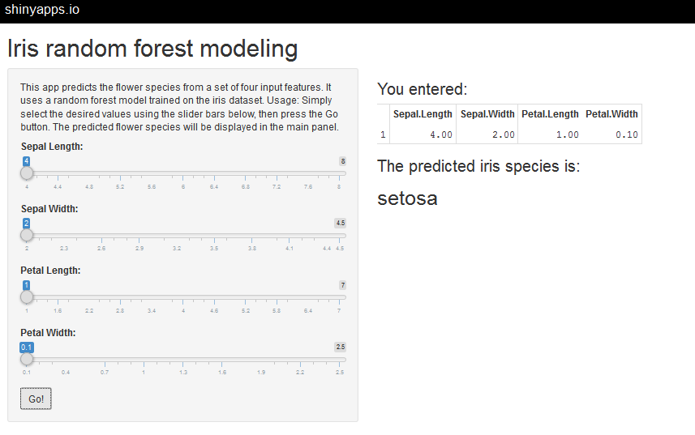

---

title       : Iris Random Forest model
subtitle    : 
author      : 
job         : 
framework   : io2012        # {io2012, html5slides, shower, dzslides, ...}
highlighter : highlight.js  # {highlight.js, prettify, highlight}
hitheme     : tomorrow      # 
widgets     : []            # {mathjax, quiz, bootstrap}
mode        : selfcontained # {standalone, draft}
knit        : slidify::knit2slides

---

## Motivation
This app was built to enable the prediction of flower species from a set of four measured features.
It uses a random forest model built on the iris dataset.

---

## Building and saving the model


```r
library(randomForest)
library(caret)
data(iris)
inTrain <- createDataPartition(iris$Species,p=0.7,list=F)
train <- iris[inTrain,]
test <- iris[-inTrain,]
fit <- train(Species~.,data=train,method="rf")
save(fit,file="rfmodel.RData")
```

--- 

## Model accuracy

First, we may check how good this model performs on the test dataset.


```r
table(test$Species,predict(fit,newdata=test))
```

```
##             
##              setosa versicolor virginica
##   setosa         15          0         0
##   versicolor      0         14         1
##   virginica       0          0        15
```

Not bad!

---

## App usage

The app can be found at this web address: https://frenzyfortune.shinyapps.io/DataProd.

The inputs are adjusted on the left and the prediction appears in the main panel as shown below:


---


